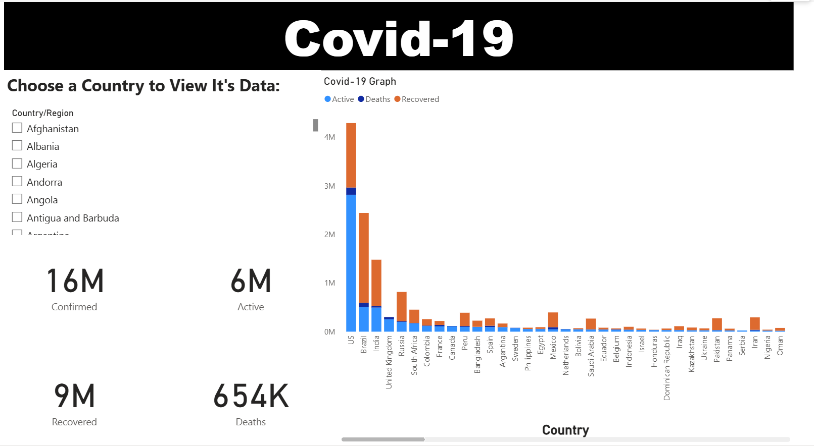

# Covid-19 Power BI Dashboard

## 📌 Overview
This project is a **Power BI Dashboard** that visualizes the global impact of the Covid-19 pandemic.  
It provides an interactive way to analyze **confirmed cases, active cases, recovered cases, and deaths** across different countries.

The dashboard was built using publicly available Covid-19 datasets and designed to give users clear insights into the spread and recovery patterns of the virus.

---

## 📊 Features
- **Country Selection:**  
  Choose a country from the left-hand panel to view its Covid-19 statistics.

- **Global Summary Metrics:**  
  - **Confirmed Cases:** 16M  
  - **Active Cases:** 6M  
  - **Recovered Cases:** 9M  
  - **Deaths:** 654K  

- **Interactive Graphs:**  
  A bar chart showing comparisons between countries for:
  - Active Cases (Blue)  
  - Deaths (Gray/Orange)  
  - Recovered Cases (Orange)  

- **User-Friendly Layout:**  
  - Bold header for clarity  
  - Key statistics displayed in large, easy-to-read numbers  
  - Dynamic visuals to highlight global vs. country-level data  

---

## 🛠️ Tools & Technologies
- **Power BI Desktop** for data modeling & dashboard design  
- **Covid-19 dataset** (public source, e.g., WHO or Johns Hopkins University)  

---

## 📷 Screenshot
Below is a preview of the dashboard:  

---

## 🚀 How to Use
1. Open the `.pbix` file in **Power BI Desktop**.  
2. Interact with the country filter to explore data.  
3. Analyze global and regional Covid-19 impact.

---

## 📌 Notes
- This version contains only a screenshot preview, not an interactive link.  
- To make it interactive online, publish the report to **Power BI Service** (requires a Microsoft/organizational account).

---

## 📄 License
This project is for **educational and demonstration purposes** only. Data accuracy depends on the source dataset used.

---
